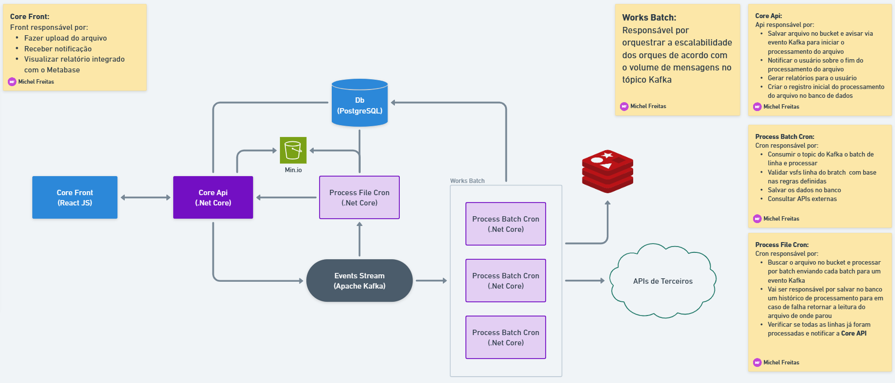

# 📂 Sistema de Processamento Massivo de Arquivos com Kafka, MinIO e Cache

Este projeto é uma solução escalável para processamento de arquivos CSV contendo entre **600 mil a 800 mil registros**, com suporte a **fila Kafka**, **armazenamento MinIO**, **processamento distribuído**, **cache com Redis**, e **escalabilidade automática com KEDA**.

O projeto segue os princípios da **Clean Architecture**, utiliza **DDD (Domain-Driven Design)** para modelagem do domínio e aplica o padrão **CQRS (Command Query Responsibility Segregation)** com o uso da biblioteca **MediatR**.

## 🧩 Tecnologias Utilizadas

- [.NET Core 8](https://dotnet.microsoft.com/)
- [Entity Framework Core](https://learn.microsoft.com/pt-br/ef/core/)
- [Apache Kafka](https://kafka.apache.org/)
- [Kafka-UI](https://docs.kafka-ui.provectus.io/)
- [MinIO](https://min.io/)
- [Redis](https://redis.io/) (cache distribuído)
- [KEDA](https://keda.sh/)
- [MediatR](https://github.com/jbogard/MediatR) (para CQRS)
- [Docker](https://www.docker.com/)
- [PostgreSQL](https://www.postgresql.org/)
- [Swagger](https://swagger.io/) (API docs)

### Padrões utilizados:

- **CQRS**: Separação clara entre comandos (escrita) e queries (leitura)
- **MediatR**: Usado para orquestrar a comunicação entre Handlers
- **DDD**: Entidades ricas, Repositórios, Value Objects e Serviços de Domínio
- **Event Driven**: Processamento baseado em eventos Kafka
- **Cache distribuído**: Redis para otimizar chamadas a APIs externas
- **Unit Of Work**: Usado para gerenciar as transações do banco de dados

## 🧠 Visão Geral da Arquitetura



## 🏛️ Arquitetura do Projeto

```
EM CONSTRUÇÃO
```

## ⚙️ Fluxo de Execução

### 1. Upload do Arquivo (API)

- O usuário envia um `.csv` para a API
- A API:

  - Armazena o arquivo no MinIO
  - Registra os metadados (ID, caminho, status, usuário)
  - Publica um evento no Kafka (`processar-arquivo`)

### 2. Leitura e Fatiamento (Worker Leitor)

- Escuta a fila `processar-arquivo`
- Faz o download do arquivo do MinIO
- Lê o conteúdo em blocos de 500 linhas
- Publica cada batch em `batch-linhas-para-processar`

### 3. Processamento (Worker Processador)

- Escuta `batch-linhas-para-processar`
- Para cada linha:

  - Consulta a **API de câmbio** (com Redis cache)
  - Consulta a **API de localização** (com Redis cache)
  - Aplica regras de negócio
  - Persiste os dados no banco

## 🧰 Cache Inteligente com Redis

```
EM CONSTRUÇÃO
```

## ⚡ Escalabilidade com KEDA

```
EM CONSTRUÇÃO
```

## 🚀 Como Executar Localmente

```
EM CONSTRUÇÃO
```

## 👨‍💻 Autor

Desenvolvido por [Michel Freitas](https://github.com/Michel-Freitas) como solução escalável para processamento de arquivos massivos com integração a sistemas externos.

## 📄 Licença

Este projeto está licenciado sob a [MIT License](https://chatgpt.com/c/LICENSE).
